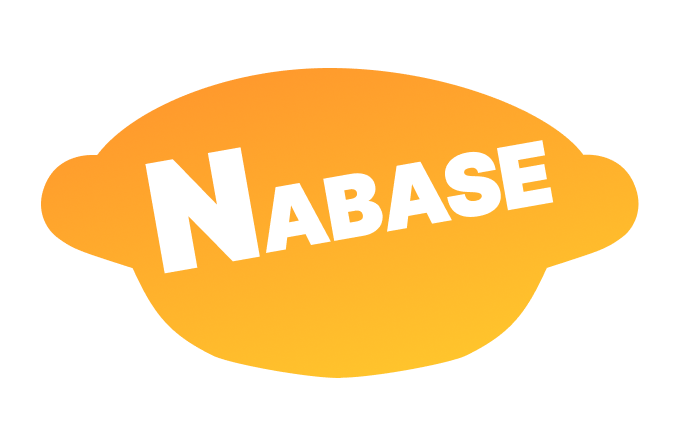
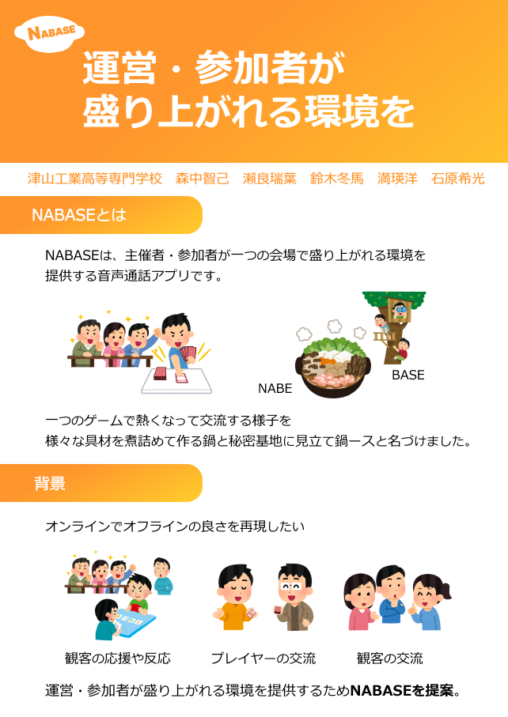
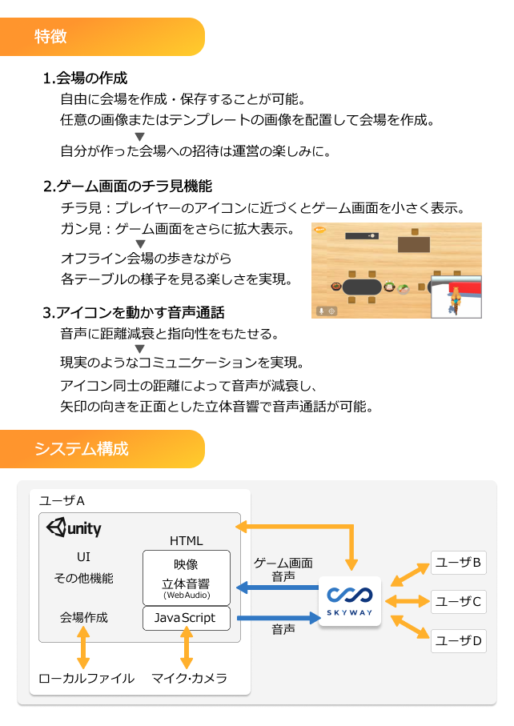
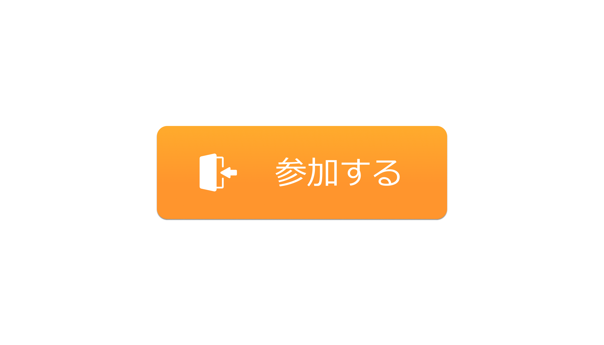
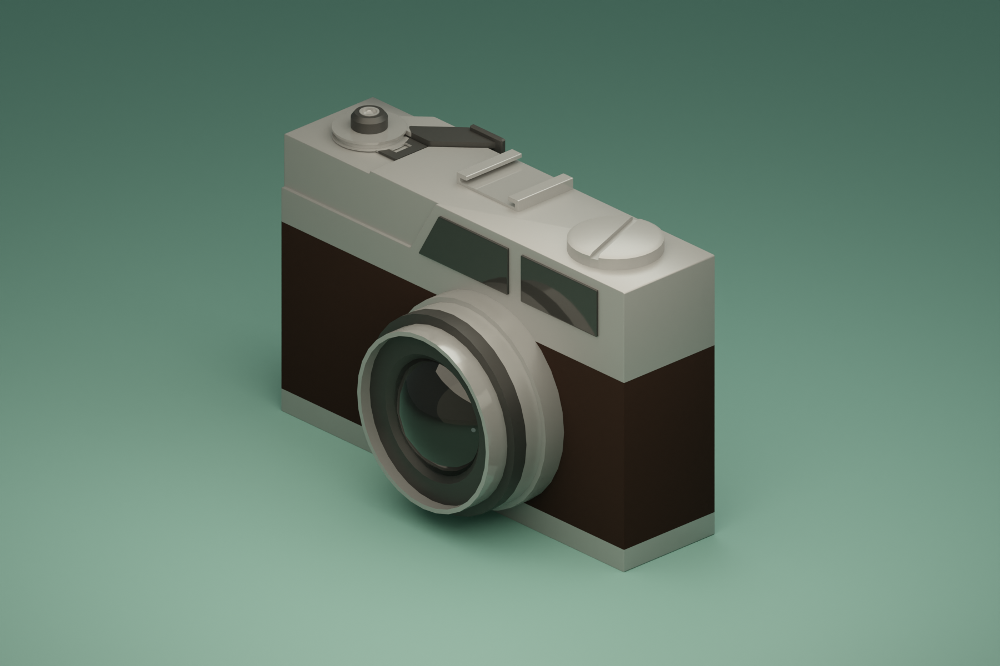

# 成果物
このリポジトリはこれまでの成果物の一部をまとめたものです。
## 内容
- **Figma作品**
  - [高専プロコン参加作品](#高専プロコン参加作品)
- **Blender作品**
  - [クリスタルの3Dモデル](#クリスタルの3Dモデル)
  - [カメラの3Dモデル](#カメラの3Dモデル)
  - [簡易なアニメーション](#簡易なアニメーション)
- **コード作品**
  - [Python](#Python)
- **触れたことがある技術**

## Figma作品
### 高専プロコン参加作品
- **概要**  
全国高等専門学校プログラミングコンテスト第34回福井大会(2023)に参加した際に作成しました。

- **担当**
  - アプリのロゴ
  - ブース用ポスター
  - ボタン等の素材のデザイン
  - 会場案の作成
 
- **ポイント**  
  ロゴは鍋の形にし、色は親しみやすく温かみのあるオレンジを採用しました。  
  全体的に統一感を持たせるためにロゴのオレンジをメインカラーとし、カラーコードで管理しました。  
  ボタンデザインでは、何のボタンなのかを分かりやすくするために文字だけでなくアイコンもいれました。  
  会場案はメンバーと協力し、何度も改良改善を繰り返して作成しました。  
  ポスターは遠くからでも見やすいように、文字のサイズやフォント、行間などを何度も試行錯誤しながら決定しました。  
  自分だけで見ていると視野が狭くなってしまうと思ったので、様々な人に確認しながら制作を進めました。
    
アプリのロゴ  

ブース用ポスター

  
  

ボタンデザイン

## blender作品
### クリスタルの3Dモデル

形状はもちろん、質感にこだわりました。  
少し発光させることにより、ファンタジーな雰囲気を表現しました。  
また、光の周りへの影響なども考えつつ調整し、モデリングしました。  
また、ノードありのモデルへの挑戦もしました。  

### カメラの3Dモデル

身近なものをモデリングしてみようと思い作成しました。  
それまでに作ってきたモデルよりもパーツが多く複雑なものに挑戦しようと思い、カメラを選びました。  
シンプルになるようにパーツを簡略化しました。  
少し角が鋭利だったり、素材の質感の表現できていなかったりするところが今後の課題だと思っています。

### 簡易なアニメーション
[動画を見る](drink_animation_blender.mp4)

流体のアニメーションに挑戦しました。  
波紋の表現やグラデーションにこだわりました。  
少し画面が暗く寂しくなってしまっているのが今後の課題です。

## コード作品
### Python
#### 概要  
[ソースコードはこちら](tempCodeRunnnerFile.py)  
これは近似計算を行うためのプログラムです。  

#### 背景  
このプログラムを制作したのは、熱力学概論という科目の試験で出題された問題を解き直している時に、  
担当教員に「情報系なんだからプログラミングとかで求めてみてよ」と言われたことがきっかけでした。  
この科目には研究室に通うほど力をいれていたため、やってやろうという気持ちでプログラムを考えました。

#### 作成過程  
まず、1年生のころから学んでいるC言語で挑戦してみました。  
しかし、思ったように動作しなかったため、Pythonに切り替えました。
乱数の生成方法など足りない知識が多かったため、調べて改良してをたくさん繰り返しました。
レポートとして提出するものだったので、コメント文もこまめに入れるように心がけました。  

#### 結果 
無事、熱量Qを式変形ではなくPythonを用いて近似計算することで求めることができました。  
技術不足と時間に追われていたため、最後は手動で値を更新するという方法で押し切ってしまったものの 
当時の自分のすべてを持って作成をすることができました。  
担当教員からの好評もいただけ、満足のいく結果となりました。 

## 触れたことがある技術
### 独学
- blender  
  3Dモデリング,簡易なアニメーション
- Figma  
  ポスター,アイコン,フローチャート,キャラクターなど
- Live2D
  モデリング,ショートアニメーション
- Adobe Illustrator
  バナー,ポスター
### 授業等
- C言語
- Python
- HTTP
- HTML

